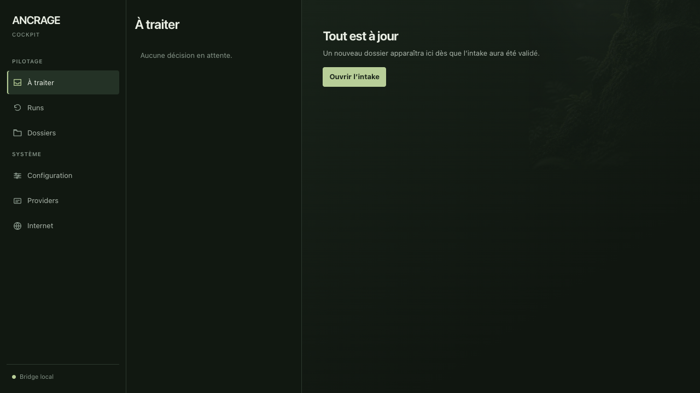
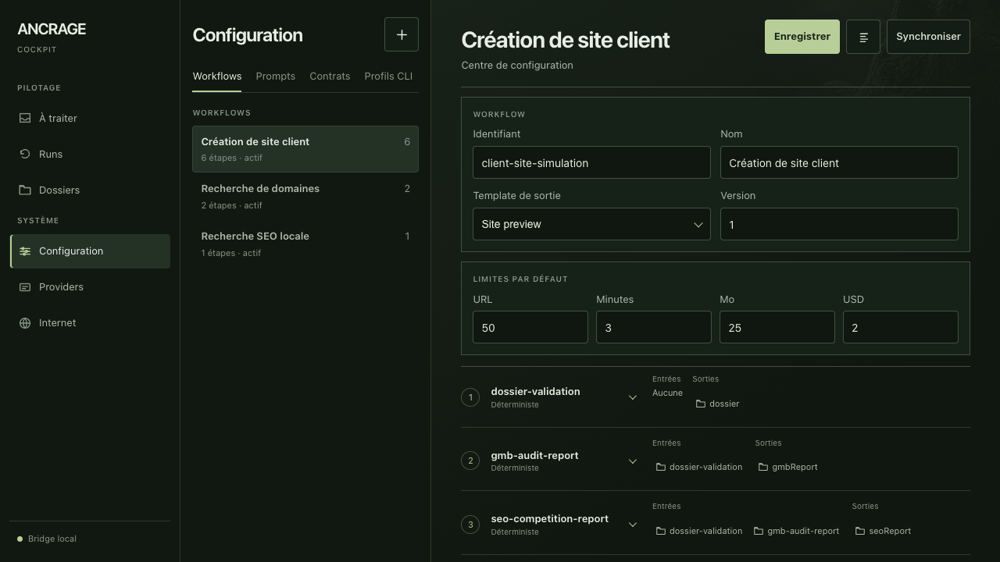

# Ancrage / Website Factory

## Le projet en quelques mots

Je prépare un outil pour organiser le travail de création de sites pour des entreprises locales. L'idée est de suivre un dossier depuis la collecte des informations jusqu'à un rapport d'audit et un aperçu du futur site.

Le prototype contient un formulaire de dossier, un tableau de suivi, des rapports et un aperçu de site. Il explore une manière de rendre le travail plus régulier et de reprendre une tâche interrompue.

Ce projet montre mon travail sur l'organisation d'une activité de service. Les essais actuels utilisent des données de test ; le fonctionnement avec les services externes et la publication de sites restent à valider.

## Comment le découvrir

Vous pouvez lire cette présentation sans rien installer. Pour visiter le prototype sur votre ordinateur : installer Node.js 22 ou supérieur, [télécharger le ZIP](https://github.com/cpointis96-hue/business-site-factory/archive/HEAD.zip), l'extraire, puis ouvrir un terminal dans le dossier qui contient `package.json`.

Saisir `npm run dev`, puis ouvrir [le tableau de suivi local](http://127.0.0.1:4173). Garder le terminal ouvert pendant la visite ; Ctrl+C permet de l'arrêter. Cette version ne demande pas de compte pour ouvrir son interface locale. Les fonctions connectées à des fournisseurs demandent une configuration supplémentaire.

## Le concept : mon cockpit de création de sites

J'ai conçu mon propre cockpit, c'est-à-dire un tableau de pilotage pour garder la main sur les dossiers, les étapes de production, les audits et les résultats. Mon objectif est d'organiser une activité de création de sites autour d'un processus que je peux suivre, contrôler et améliorer.

Deux interfaces répondent à des besoins différents : le côté client sert à recueillir les informations de l'établissement et son offre ; mon cockpit sert à organiser le travail et à examiner ce que chaque étape produit.



## Ce qui est déjà mis en place

- Un dossier d'établissement pour rassembler son identité, son histoire, son offre, ses prix et ses images.
- Une interface de saisie côté client pour préparer ces informations.
- Un suivi des exécutions : étapes, progression, résultats et éléments de preuve conservés.
- Des workflows modifiables : ce sont les suites d'étapes qui organisent le travail, avec leurs dépendances et leurs validations.
- Des rapports de visibilité locale et de référencement, puis un plan de contenu, un aperçu de site et des contrôles qualité dans le parcours de simulation.
- Des consignes et modèles de rapports versionnés pour conserver la méthode utilisée à chaque exécution.
- Une reprise après interruption et un stockage des résultats sur l'ordinateur.
- Un suivi des coûts et des budgets maximum avant les appels à des services externes. Les prix de l'offre de l'établissement sont également stockés dans son dossier ; le prototype ne démontre pas encore une activité de facturation ou de vente.



## Le parcours prévu

Informations du client → validation du dossier → audit de visibilité locale → analyse SEO et concurrence → plan de contenu → aperçu du site → contrôle qualité et validation.

La simulation locale parcourt cette chaîne et produit ses rapports et son aperçu. Les rapports simulés servent à vérifier l'organisation du processus ; ils ne prouvent pas qu'une analyse complète de concurrents réels a été effectuée automatiquement.

## Où en est le projet ?

Le socle et les interfaces sont construits. La vérification du 4 octobre 2026 a fait passer 116 tests couvrant notamment les dossiers, les étapes, les versions, les coûts et la reprise. Les écrans du cockpit, de configuration et de saisie client ont été ouverts dans un navigateur.

L'utilisation des fournisseurs réels, la sauvegarde et restauration en conditions réelles et le parcours complet d'un client restent à vérifier. Le projet prépare une activité ; il ne présente pas des commandes clients ou des revenus déjà obtenus.

## Les prochaines étapes

Tester la chaîne sur un dossier autorisé, vérifier les sources des audits et la qualité des contenus, valider les connexions externes et leurs budgets, puis éprouver le parcours client et la publication d'un site avec validation humaine.

Ce travail m'amène à articuler collecte d'informations, recherche locale, conception de contenu, organisation des tâches, contrôle qualité et maîtrise des coûts dans un même outil.

<details>
<summary>Installation, architecture et détails techniques</summary>

## En bref

**Ce que c’est :** un cockpit local pour préparer des dossiers d’établissement et suivre leur production.

**À quoi il sert :** enchaîner des étapes versionnées, produire un rapport d’audit et générer un aperçu de site avant validation par un opérateur.

**Ce qui a été réalisé :** moteur de workflow, API locale, interface de cockpit, entrée de dossier, rapports, aperçu de site et scénarios de reprise.

**Technologies :** Node.js, API HTTP locale, HTML, CSS et JavaScript.

Les intégrations réelles, la publication et les opérations commerciales demandent encore une validation dans leur environnement cible.

## Démarrer

Node.js 22 ou supérieur est requis. Il n’y a aucune dépendance npm externe ni installation à effectuer.

```sh
npm test
npm run check
npm run dev
```

Ouvrir `http://127.0.0.1:4173` pour le cockpit et `http://127.0.0.1:4173/intake.html` pour l’entrée publique locale. `PORT` permet de changer le port. Les données et configurations sont créées dans `.ancrage/`; `ANCRAGE_DATA_DIR` permet de choisir un autre répertoire.

`npm test` exécute les scénarios synthétiques de création de dossier, rapports, aperçu de site, interruption et reprise. Le site issu de cette simulation est un aperçu déterministe, pas une preuve de génération commerciale par IA.

## Ce qui est présent

- Stockage atomique sur fichiers, registres de dossiers, artefacts et démos.
- Prompts, contrats JSON, templates et workflows avec versions et références figées par exécution.
- Moteur de workflows, validations, checkpoints, reprises et suivi des coûts.
- Audit SEO borné et rapports avec provenance, statut partiel et contrôles des cibles réseau.
- Adaptateurs de fournisseurs et contrôle d’activation avant utilisation.

Les appels aux fournisseurs exigent leurs propres comptes, clés, quotas et parfois un budget. Sur macOS, les secrets passent par le trousseau (`com.ancrage.provider`). Sur les autres plateformes, le magasin par défaut est en mémoire : il n’offre pas de persistance des secrets. Aucune clé n’est incluse. Les tests injectent des adaptateurs et secrets synthétiques ; ils ne valident pas les fournisseurs en production.

## Télécharger et vérifier

Sur GitHub, choisir **Code → Download ZIP**, extraire l’archive et exécuter les commandes ci-dessus depuis sa racine. Les mêmes commandes fonctionnent avec un clone Git. Voir [VERIFICATION.md](VERIFICATION.md) pour les résultats et limites observés.

Cette copie publique conserve `app/`, `src/`, `fixtures/defaults/` et `test/`. Les données locales, secrets, notes internes, runbooks liés aux comptes réels et anciens prototypes sont exclus. L’historique original n’est pas transféré. L’interface et le code fonctionnel sont conservés sans nouvelle direction visuelle.

## Suite du travail

Valider les fournisseurs avec comptes dédiés et limites explicites ; vérifier le trousseau réel, la sauvegarde/restauration et les parcours navigateur avant un usage opérationnel. Publication, achat de domaine et envoi commercial ne sont pas validés par cette préparation.

## Dépôt et téléchargement

[Voir le dépôt](https://github.com/cpointis96-hue/business-site-factory) · [Télécharger les sources ZIP](https://github.com/cpointis96-hue/business-site-factory/archive/HEAD.zip). Le ZIP contient les sources, pas un service déployé.

</details>
